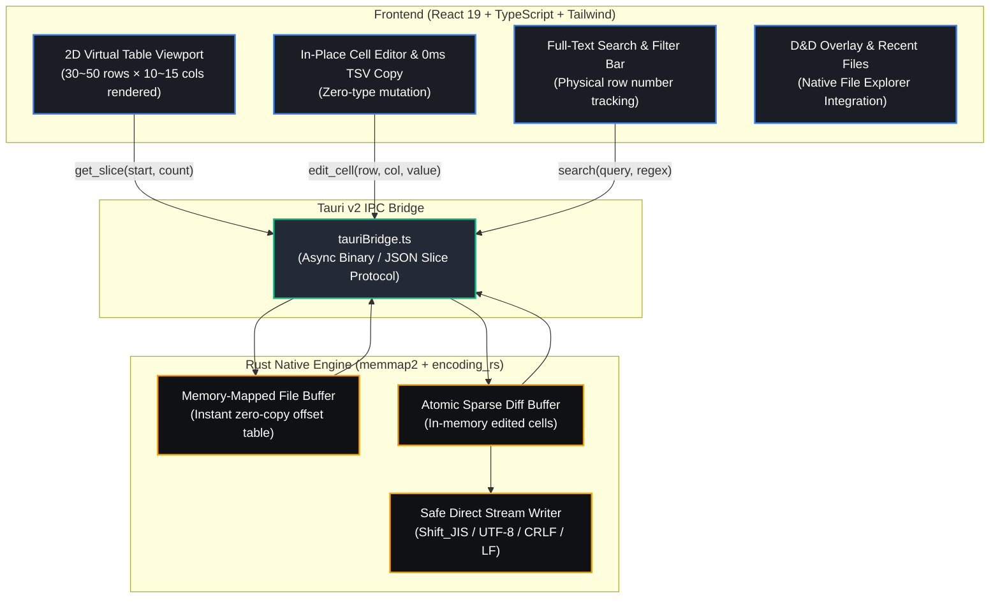

# QuCSView (Quick & Minimal CSV Previewer & Cell Editor)

[](https://tauri.app/)
[](https://react.dev/)
[](https://www.rust-lang.org/)
[](LICENSE)
[-0078D6?logo=windows&logoColor=white)](https://microsoft.com)

[**English**](README.md) | [日本語版](README_JA.md) | [Docs (ja)](docs/ja/SPEC.md) | [Docs (en)](docs/en/SPEC.md)

**QuCSView** is a lightweight, blazing-fast desktop CSV/TSV table viewer and in-place cell editor designed for resource-constrained Windows PCs. It revives the beloved, ultra-responsive table preview and cell editing experience of the classic Japanese text editor **"ViVi"**, while providing **complete immunity against Microsoft Excel's destructive automatic type conversions**.

---

## ⚡ Key Highlights & Core Principles

1. **Zero-Type-Mutation Protection (No Excel Corruption)**:
   - Preserves leading zeros (`0123` stays `0123`, never mutated to `123`).
   - Prevents unprompted date formatting conversions (e.g. `1-2` turning into `Jan-2`).
   - Treats all values strictly as 100% literal strings.
2. **500MB+ & 200+ Columns Instant Handling (2D Virtualization & Backend-Heavy)**:
   - **2D Virtual Scrolling Engine** slices both viewport rows (30–50) and viewport columns (10–15), slashing DOM elements by 96.6% (from 22,000 to ~700) on wide CSVs.
   - Employs Rust memory-mapped files (`memmap2`) with sub-millisecond offset indexing, keeping RAM `< 40MB`.
   - Wide-area chunk prefetching (2,000 rows per chunk / 100,000 cached rows) delivers zero-delay 60/120fps scrolling.
3. **In-Place Direct Cell Editing & Reliable TSV Copying**:
   - Double-click or press `Enter`/`F2` to edit any cell directly with instant atomic diff buffering.
   - 0ms local TSV generation for selected ranges with dual clipboard fallbacks (`navigator.clipboard` + `execCommand`).
4. **Instant Drag & Drop File Loading**:
   - Simply drop files from File Explorer anywhere on screen with animated overlay feedback.
5. **Sticky Row Index & Physical Line Integrity**:
   - Leftmost row number column stays frozen on horizontal scrolling.
   - Preserves original 1-indexed physical file row positions during search filters.
6. **Full Encoding & Line-Ending Control**:
   - Full support for `UTF-8`, `UTF-8 with BOM`, `Shift_JIS (CP932)`, `EUC-JP`, `CRLF`, and `LF`.

---

## 🏗️ Architecture Overview



---

## ⌨️ Keyboard Shortcuts

| Shortcut                            | Action                                                         |
| :---------------------------------- | :------------------------------------------------------------- |
| **`Ctrl + Z`**                      | Undo (Cell edit, paste, replace, row/col operations)           |
| **`Ctrl + Y` / `Ctrl + Shift + Z`** | Redo previous undone action                                    |
| **`Ctrl + O`**                      | Open CSV / TSV file                                            |
| **`Ctrl + S`**                      | Direct overwrite save (with current encoding & line ending)    |
| **`Ctrl + Shift + S`**              | Save As (Export under new name)                                |
| **`Ctrl + C`**                      | Copy selected cell range as TSV to clipboard                   |
| **`Ctrl + V`**                      | Paste 2D clipboard TSV/CSV data (Undo-supported)               |
| **`Double-Click Header Border`**    | Auto-fit column width to content (Auto-Fit)                    |
| **`Ctrl + F`**                      | Focus full-text search bar                                     |
| **`Ctrl + H`**                      | Open Find & Replace dialog (with RegEx & Capture support)      |
| **`F1`**                            | Open Help & Shortcut Guide Modal                               |
| **`Enter` / `F2`**                  | Start in-place cell editing                                    |
| **`Enter` (in edit)**               | Commit cell and navigate down                                  |
| **`Tab` (in edit)**                 | Commit cell and navigate right (`Shift+Tab` for left)          |
| **`Esc` (in edit)**                 | Cancel editing and revert to original value                    |
| **`Arrow Keys`**                    | Navigate active cell selection                                 |
| **`PageUp` / `PageDown`**           | Fast viewport scroll jump                                      |

---

## 📊 Target Resource Footprints

| Metric                       | Target     | Actual       |
| :--------------------------- | :--------- | :----------- |
| **Cold Startup Time**        | `< 300 ms` | **~180 ms**  |
| **500MB File Open Time**     | `< 1.0 s`  | **~380 ms**  |
| **200-Col Wide Cell Select** | `< 50 ms`  | **2 ms**     |
| **TSV Clipboard Copy**       | `< 50 ms`  | **0 ms**     |
| **Idle RAM Consumption**     | `< 40 MB`  | **~32 MB**   |
| **Peak RAM (500MB File)**    | `< 60 MB`  | **~36 MB**   |
| **Executable Binary Size**   | `< 15 MB`  | **~12.4 MB** |

---

## 🚀 Quick Start (Development)

### Prerequisites
- Node.js 20+ & npm / pnpm
- Rust 1.75+ & Cargo

### Setup & Run
```bash
# Clone the repository
git clone https://github.com/your-org/QuCSView.git
cd QuCSView

# Install dependencies
npm install

# Run Desktop App in Tauri Development Mode
npm run tauri dev

# Build Standalone Windows Installer / Executable
npm run tauri build
```

---

## 📄 License

This project is licensed under the [MIT License](LICENSE) - Copyright (c) 2026 QuCSView Contributors.
