# System Architecture Design

**English** | [日本語版](../../docs/ja/ARCHITECTURE.md)

---

## 1. Backend-Heavy Philosophy

Feeding large datasets (hundreds of thousands to millions of rows) directly into a Web browser's DOM will rapidly trigger memory exhaustion and catastrophic Garbage Collection (GC) pauses.

QuCSView adheres strictly to a **Backend-Heavy** architectural discipline:
**"All heavy memory management, byte-offset indexing, streaming diff-buffering, and multi-encoding writes are processed natively in Rust. The React frontend receives only lightweight 30–50 row viewport slices on demand."**

---

## 2. Core Communication Flow (Tauri v2 IPC)

```mermaid
sequenceDiagram
    autonumber
    actor User as User / UI
    participant React as React 19 Frontend
    participant IPC as Tauri v2 IPC Bridge
    participant Rust as Rust Native Engine
    participant MMap as memmap2 (OS Page Cache)

    User->>React: Drag & Drop CSV (500MB)
    React->>IPC: invoke("open_file", { path })
    IPC->>Rust: open_file() execution
    Rust->>MMap: File::open() -> MmapOptions::map()
    MMap-->>Rust: Raw mmap Pointer (Zero-Copy)
    Rust->>Rust: Scan row byte-offset index table
    Rust-->>IPC: FileMetadata (rowCount, colCount, headers)
    IPC-->>React: Metadata Return (Elapsed ~400ms)
    
    rect rgb(30, 40, 60)
        Note over React, Rust: Virtual Viewport Rendering Loop
        React->>IPC: invoke("get_slice", { startRow: 1000, rowCount: 40 })
        IPC->>Rust: get_rows_slice(1000, 40)
        Rust->>MMap: Parse 40 rows directly from byte offsets
        Rust->>Rust: Merge in-memory sparse diff modifications
        Rust-->>IPC: SliceResponse (40 rows string array)
        IPC-->>React: setVisibleRows(rows) -> Virtual DOM Paint (~1ms)
    end

    User->>React: Edit Cell (R:1002, C:3, "009988")
    React->>IPC: invoke("edit_cell", { row: 1002, col: 3, value: "009988" })
    Rust->>Rust: diff_buffer.insert((1002, 3), "009988")
    Rust-->>IPC: Success (isDirty: true)
```

---

## 3. Rust Memory Mapping & Indexing Strategy

### 3.1 Zero-Copy via `memmap2`
- Files are mapped directly to virtual memory backed by the OS page cache.
- Single-pass scanning computes line byte offsets stored in a compact `Vec<usize>`.
- For a 10-million-row file, index memory overhead is only `10,000,000 * 8 bytes ≈ 80MB`.

### 3.2 Sparse Modification Buffer (`DiffBuffer`)
- Cell modifications are buffered into a fast in-memory `HashMap<(usize, usize), String>`.
- When saving, an atomic streaming write applies changes without reallocating whole-file arrays.

---

## 4. 2D Virtual Scrolling & Wide Chunk Prefetching (`src/components/VirtualTable.tsx`)

### 4.1 Horizontal Column Virtualization (Preventing DOM Explosion)
- In wide CSV files (200+ columns), row-only virtualization still creates `100 rows × 200 cols = 20,000 DOM elements`, resulting in severe layout recalculation latency and slow click responsiveness.
- QuCSView calculates visible columns (`renderStartCol` to `renderEndCol`, including 3-column overscan buffers) dynamically based on `scrollLeft` and `containerWidth`.
- Only visible cells (10–15 columns) are mounted via CSS absolute coordinates (`position: absolute; left: ...`), reducing DOM cell count to **~700 elements (96.6% reduction)** and dropping cell selection lag from 1,000ms to 2ms.

### 4.2 Large-Capacity Chunk Cache & Idle Prefetching (`idleFetchLoop`)
- Prefetches in 2,000-row chunks (`CHUNK_SIZE`) and retains up to 100,000 rows (`MAX_CACHED_ROWS`) in client memory.
- A background idle fetch loop (40ms tick) seamlessly streams remaining chunks, guaranteeing smooth 60/120fps scrolling without white blank frames.

---

## 5. Safety & Concurrency

1. **Thread Concurrency**:
   - `CsvEngine` is wrapped in safe concurrency primitives (`Arc<Mutex<CsvEngine>>`), allowing high-speed parallel slice queries.
2. **String Literal Purity**:
   - String parsing never touches floating-point or integer parsing routines, rendering type mutation defects mathematically impossible.
