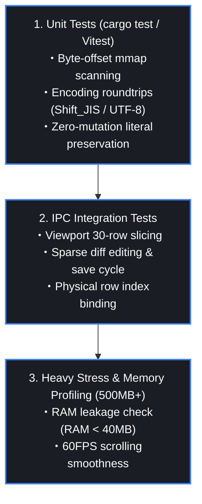

# Testing Strategy

**English** | [日本語版](../../docs/ja/TESTING.md)

---

## 1. Testing Pyramid & Verification Levels



---

## 2. Rust Unit Tests (`src-tauri`)

### Execution Command
```bash
cd src-tauri
cargo test -- --nocapture
```

### Core Test Cases
1. **`test_mmap_offset_indexing`**:
   - Accurate byte offset calculation across `CRLF`, `LF`, and mixed line breaks.
2. **`test_zero_type_mutation_preservation`**:
   - Verify that strings like `00123`, `090-0000-0000`, and `2026/08/20` remain strictly unmodified through parsing, cell editing, and file serialization.
3. **`test_encoding_roundtrip`**:
   - Verify zero mojibake when roundtripping Shift_JIS/CP932 Japanese characters.

---

## 3. Frontend & IPC Integration Tests

1. **Virtual Window Boundary Tests**:
   - Verify slicing behavior at index 0, total row count boundary, and random fast-scroll jumps.
2. **Physical Row Binding Tests**:
   - Verify that Filter Mode correctly renders 1-indexed source row numbers in the frozen `#` column.
