# システム設計書 (Architecture Design)

[English](../../docs/en/ARCHITECTURE.md) | **日本語版**

---

## 1. Backend-Heavy 設計思想

Webフロントエンド（DOM）に数十万行〜数百万行のデータをそのまま流し込むと、DOMノードの過多とV8ガベージコレクション（GC）の停止により、ブラウザは即座にフリーズします。

QuCSViewでは、**「データ処理・インデックス化・メモリ管理はすべてRustバックエンド側で完結させ、フロントエンドには画面枠内（30〜50行）の描画用スライスのみを渡す」** という **Backend-Heavy** アーキテクチャを徹底しています。

---

## 2. コア通信シーケンス (Tauri v2 IPC)

```mermaid
sequenceDiagram
    autonumber
    actor User as ユーザー / UI
    participant React as React 19 Frontend
    participant IPC as Tauri v2 IPC Bridge
    participant Rust as Rust Native Engine
    participant MMap as memmap2 (OS Page Cache)

    User->>React: CSVファイルをドラッグ＆ドロップ (500MB)
    React->>IPC: invoke("open_file", { path })
    IPC->>Rust: open_file() 呼び出し
    Rust->>MMap: File::open() -> MmapOptions::map()
    MMap-->>Rust: mmap ポインタ (0ms コピーゼロ)
    Rust->>Rust: 改行オフセットテーブル生成 (Byte Scan)
    Rust-->>IPC: FileMetadata (行数, 列数, ヘッダー一覧)
    IPC-->>React: メタデータ返却 (所要時間 ~400ms)
    
    rect rgb(30, 40, 60)
        Note over React, Rust: 仮想スクロール描画ループ
        React->>IPC: invoke("get_slice", { startRow: 1000, rowCount: 40 })
        IPC->>Rust: get_rows_slice(1000, 40)
        Rust->>MMap: オフセット位置から直接40行のみパース
        Rust->>Rust: 差分バッファ(HashMap)のマージ
        Rust-->>IPC: SliceResponse (40行分のテキスト配列)
        IPC-->>React: setVisibleRows(rows) -> 仮想DOM描画 (所要時間 ~1ms)
    end

    User->>React: セル編集 (R:1002, C:3, "009988")
    React->>IPC: invoke("edit_cell", { row: 1002, col: 3, value: "009988" })
    Rust->>Rust: diff_buffer.insert((1002, 3), "009988")
    Rust-->>IPC: Success (isDirty: true)
```

---

## 3. Rustメモリマップとインデックス構造 (`src-tauri/src/csv_engine.rs`)

### 3.1 `memmap2` によるゼロコピー
- OSのページキャッシュを直接利用するため、500MBのファイルであってもアプリプロセスの物理メモリを消費しません。
- 起動時に単一パスの高速バイト走査（`\n` / `\r\n` の検出）を行い、各行の先頭バイトオフセット（`Vec<usize>`）を構築します。
- 1,000万行のCSVであっても、インデックスに必要なメモリは `10,000,000 × 8 bytes ≈ 80MB` のみです。

### 3.2 スパース差分バッファ (`DiffBuffer`)
- ユーザーによるセルの変更は、元のファイルバッファを直接破壊せず、`HashMap<(usize, usize), String>` にスパース（疎）に記録されます。
- 保存（`save_file`）要求時、メモリマップドバッファから元データをストリーミング読み出ししつつ、差分バッファの値を置換して指定エンコーディング（`Shift_JIS` / `UTF-8`）で一括出力します。

---

## 4. 2次元仮想スクロール＆広域チャンクキャッシュ (`src/components/VirtualTable.tsx`)

### 4.1 カラム仮想化（Horizontal Virtualization）によるDOM爆発防止
- 行数だけでなくカラム数（200列超）が多い場合、行のみの仮想化では `100行 × 200列 = 20,000個` のセルDOMが生成され、ブラウザのスタイル計算とクリック反応が著しく遅延します。
- QuCSView では、`scrollLeft` と `containerWidth` から可視列範囲（`renderStartCol` 〜 `renderEndCol`、左右3列のOverscan込み）を算出し、**画面内に見えている列（10〜15列）のみを絶対配置（`position: absolute; left: ...`）でスライス描画**します。
- これにより、200列超の巨大ファイルであってもDOMセル数を **700個前後（96.6%削減）** に抑え、セル選択ラグを 1,000ms から 2ms に短縮しています。

### 4.2 広域チャンクキャッシュ＆アイドル先読み (`idleFetchLoop`)
- 2,000行単位（`CHUNK_SIZE`）で広域データを取得し、最大100,000行（`MAX_CACHED_ROWS`）をフロントエンドメモリに常駐。
- `requestIdleCallback` / 40ms タイマーを活用したバックグラウンド先読みループにより、高速スクロール時でも白枠を描画させず **60/120fpsの完全同期スクロール** を維持します。

---

## 5. メモリ安全性とスレッドモデル

1. **Rustのスレッド安全性**:
   - `CsvEngine` は `Arc<Mutex<CsvEngine>>` で保護され、Tauriの非同期ワーカースレッドプールから安全にアクセスされます。
2. **文字列リテラル保護**:
   - パース処理では数値変換ルーチン（`f64::parse` 等）を一切経由せず、スライスから直接UTF-8文字列として抽出するため、型の誤判定や桁落ちが構造上発生しません。
