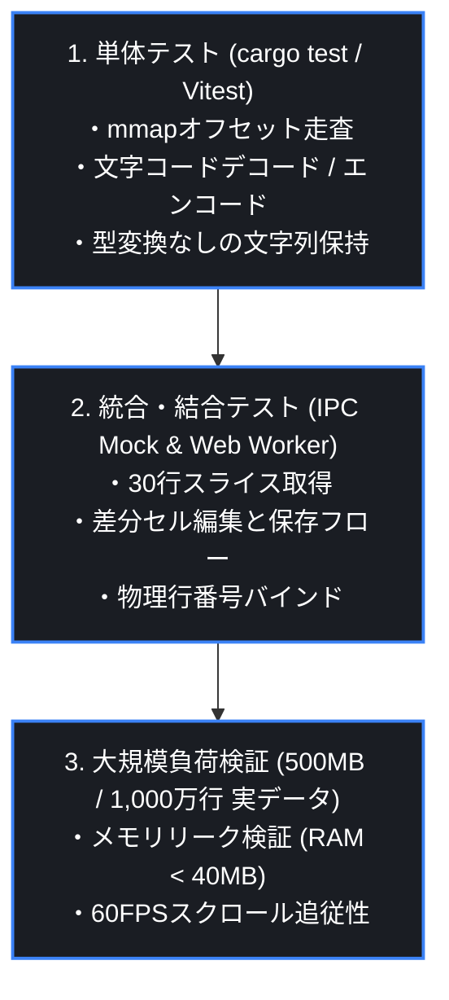

# テスト方針書 (Testing Strategy)

[English](../../docs/en/TESTING.md) | **日本語版**

---

## 1. テスト階層とテストピラミッド

QuCSVPreviewでは、堅牢なデータ整合性と高速性を担保するため、以下の3階層で自動テストおよび手動負荷検証を実施します。



---

## 2. Rust側単体テスト項目 (`src-tauri`)

### コマンド
```bash
cd src-tauri
cargo test -- --nocapture
```

### 主要検証項目
1. **`test_mmap_offset_indexing`**:
   - `CRLF`, `LF`, 混合改行を含むCSVの各行オフセットが1バイトの狂いもなく正確に算出されるか。
2. **`test_zero_type_mutation_preservation`**:
   - `00123`, `00-4491-00`, `2026/08/20` などの文字列がパース・編集・保存後も完全に等価であるか。
3. **`test_encoding_roundtrip`**:
   - `Shift_JIS (CP932)` 特有の機種依存文字（①, ㈱, 髙 等）が文字化けせずに往復保存できるか。

---

## 3. フロントエンド・IPC結合テスト項目

1. **仮想スクロールスライス境界テスト**:
   - 行番号 `0`、最終行、および任意の中間位置で要求された行数が正しくDOMに反映されるか。
2. **行フィルタ時物理行番号追跡テスト**:
   - フィルタ時に表示される `#` 列の数値が、元CSVの物理行番号と一致しているか。
